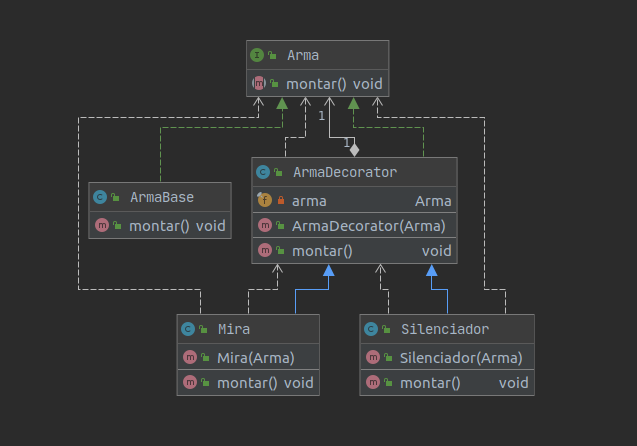

## Decorator

### Categoria
* Estrutural

### Explicação

Decorator, wrapper, é um padrão de projeto de software que permite adicionar um comportamento a um objeto já existente em tempo de execução, ou seja, agrega dinamicamente responsabilidades adicionais a um objeto.
 
Decorators oferecem uma alternativa flexível ao uso de herança para estender uma funcionalidade, com isso adiciona-se uma responsabilidade ao objeto e não à classe.

O Decorator surgiu da necessidade de adicionar um comportamento, funcionalidade ou estado extra a um objeto em tempo de execução, por exemplo quando Herança não é concebível por ser um caso que geraria um número muito alto de sub-classes.

### Problema

Imaginando que queremos construir uma arma, temos uma arma padrão (sem acessórios) e queremos adicionar acessórios a esta arma, tais como mira e silenciador

### Solução

Implementar um padrão, onde possamos adicionar comportamentos dinamicamente, facilitando a flexibilidade e evitando uma "explosão" de subclasses.

## Exemplo

