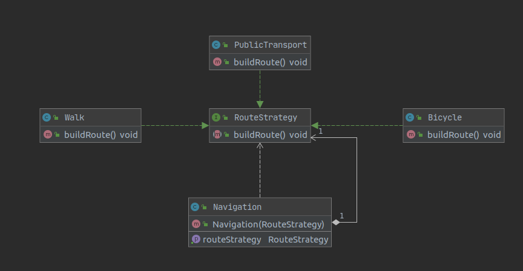

## Strategy

### Categoria
* Comportamental

### Explicação

O Strategy é um padrão de projeto comportamental que permite que você defina uma família de algoritmos, coloque-os em classes separadas, e faça os objetos deles intercambiáveis.

### Problema

Imagine uma aplicação de navegação para viajantes. O objetivo da aplicação é planejar rotas automaticamente para que os usuários de desloquem facilmente em uma cidade.

Assim, o usuário seria capaz de ver qual a rota mais rápida a ser seguida.

A primeira versão da aplicação podia apenas construir rotas sobre rodovias. As pessoas que viajam de carro adoraram. Porém aparentemente, nem todo mundo dirige em suas férias. Então com a próxima atualização você adicionou uma opção de construir rotas de caminhada. Logo após isso você adicionou outra opção para permitir que as pessoas usem o transporte público.

Contudo, isso foi apenas o começo. Mais tarde você planejou adicionar um construtor de rotas para ciclistas.

### Solução

O padrão Strategy sugere que você pegue uma classe que faz algo específico em diversas maneiras diferentes e extraia todos esses algoritmos para classes separadas chamadas estratégias.

A classe original, chamada contexto, deve ter um campo para armazenar uma referência para um dessas estratégias. O contexto delega o trabalho para um objeto estratégia ao invés de executá-lo por conta própria.

O contexto não é responsável por selecionar um algoritmo apropriado para o trabalho. Ao invés disso, o cliente passa a estratégia desejada para o contexto. Na verdade, o contexto não sabe muito sobre as estratégias. Ele trabalha com todas elas através de uma interface genérica, que somente expõe um único método para acionar o algoritmo encapsulado dentro da estratégia selecionada.

## Exemplo

A finalizar com exemplos de código....